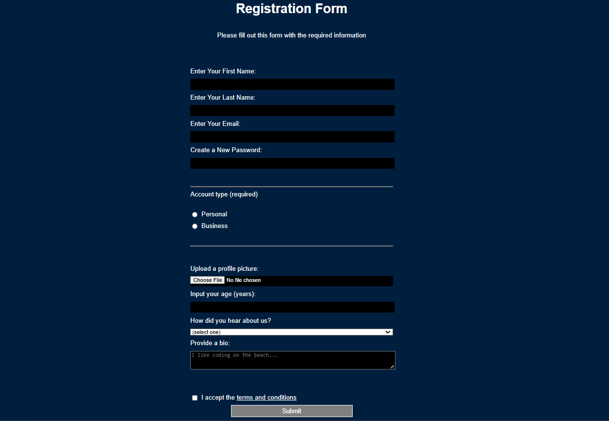

# 📋 Stylish Web Form — HTML & CSS Only

> 🧠 A clean and responsive web form designed with just HTML and CSS.  
> ✨ No frameworks. No JavaScript. Just simplicity and elegance.

---

## 🌐 Live Demo

🌍 [Click to View on GitHub Pages](https://nancy-jaiswal19.github.io/form-html-css/)  
_(Looks smooth on mobile too!)_

---

## 🧠 What I Learned

- Semantic HTML for forms
- Grouping form controls
- CSS styling for input, textarea, button
- Layout tricks using Flexbox / Grid
- Validating forms with HTML attributes

---

## 🧩 Features

✅ Fully responsive layout  
✅ Works on all screen sizes  
✅ Organized project structure  
✅ Zero frameworks — just pure HTML & CSS  
✅ Beginner-friendly & readable code  

---

## 📁 Project Structure

img-gallery-html-css/
├── docs/
│ ├── index.html
│ ├── style.css
│ └── screenshot.png
├── README.md

---

## 📸 Sneak Peek

> 

---

## 🙋‍♀️ About Me

**Nancy Jaiswal**  
BTech CSE Student 👩‍💻 | Learning Web Dev & DSA  
🌐 [My GitHub](https://github.com/nancy-jaiswal19)

---

## 🚧 Next Upgrade Ideas

- Add success/error message after submit
- Style with CSS animations
- Add dark/light mode toggle 🌙☀️

---

### ⭐ Give it a star if you like it!

This is one step in my journey. More projects coming — stay tuned 💥
